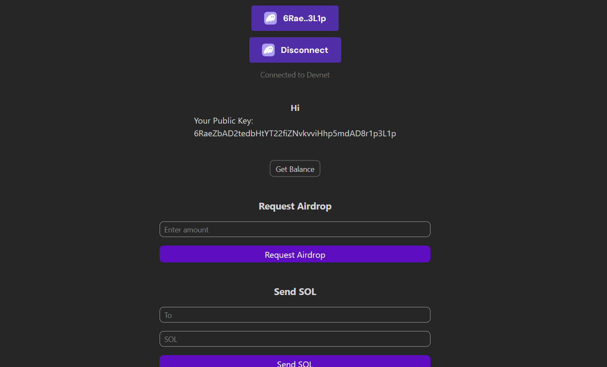

# Solana Wallet Adapter dApp

A React dApp demonstrating Solana wallet integration using `@solana/wallet-adapter`.

> Deployed at: https://sol-wallet-adap.vercel.app/

## Features

- **Connect Wallet** - Connect to Phantom, Solflare, and other Solana wallets
- **Show Balance** - Display wallet SOL balance
- **Request Airdrop** - Get devnet SOL for testing
- **Send SOL** - Transfer SOL to another address
- **Sign Message** - Sign messages with your wallet and verify using Ed25519

## Tech Stack

- React 19 + TypeScript
- Vite
- Tailwind CSS v4
- Solana Wallet Adapter
- @solana/web3.js

## Project Structure

```
src/
├── App.tsx                 # Main app with wallet providers
├── components/
│   ├── Greet.tsx           # Welcome message & public key display
│   ├── Airdrop.tsx         # Request devnet SOL
│   ├── ShowBalance.tsx     # Display wallet balance
│   ├── DoTransaction.tsx   # Send SOL to address
│   └── SignMessage.tsx     # Sign & verify messages
└── ui/
    ├── Button.tsx          # Reusable button component
    └── Input.tsx           # Reusable input component
```

## Setup

```bash
npm install
npm run dev
```

## Network

Connected to **Solana Devnet** (`https://api.devnet.solana.com`)

## Screenshot

